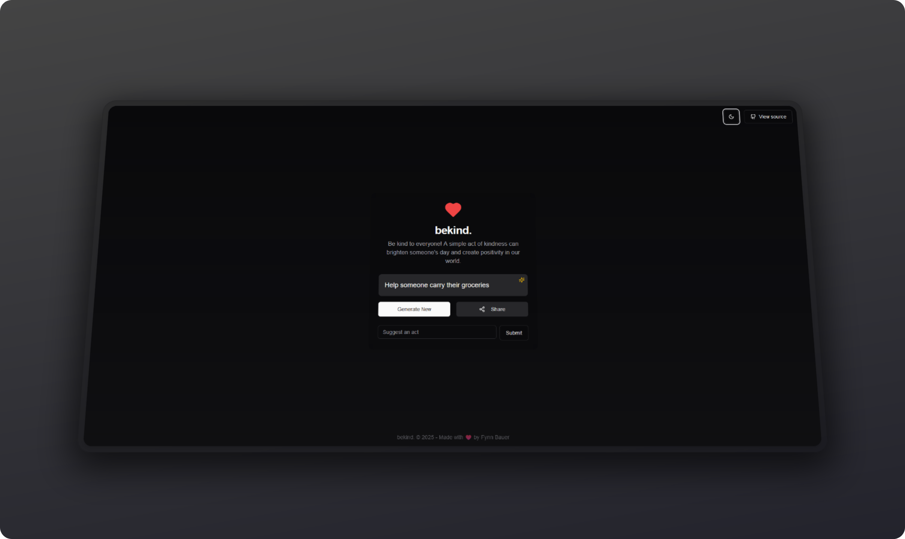

<p align="center">
  <h2 align="center">
    bekind.
  </h2>

  <p align="center">
    be kind to everyone.
    <br />
    <br />
    <a href="https://bekind.now">Website</a>
    ·
    <a href="https://github.com/kaseax/bekind/issues">Issues</a>
  </p>

[](https://github.com/kaseax/bekind/stargazers)
[](./LICENSE.md)

</p>

## About the Project

bekind. is a website that promotes kindness and positivity. It provides the way to generate an "act of kindness" that you can do to make someone's day better.

### Features

- Generate random acts of kindness.
- Simple and intuitive design to encourage daily positivity.
- Share acts of kindness with your friends and family.
- Open source and community-driven.

## Installation

### Prerequisites

- Node.js >= v18
- npm >= v10

### Steps

1. Clone the repository:
   ```bash
   git clone https://github.com/kaseax/bekind.git
   ```
2. Navigate to the project directory:
   ```bash
   cd bekind
   ```
3. Install dependencies:
   ```bash
   npm install
   ```
4. Start the development server:
   ```bash
   npm run dev
   ```
5. Open your browser and visit:
   ```
   http://localhost:3000
   ```

## Preview

Here’s how the website looks in action:



## Technologies Used

- **Frontend:** React, shadcn/ui, Tailwind CSS
- **Backend:** Node.js, Next.js, Upstash (Ratelimiting)
- **Database:** Supabase
- **Hosting:** Vercel

## Contribution

bekind. is a free and open source project licensed under the [AGPL-3.0 License](./LICENSE.md).

You could help continuing its development by:

- [Contribute to the source code](./CONTRIBUTING.md)
- [Suggest new features and report issues](https://github.com/kaseax/bekind/issues)

## Acknowledgments

- Inspired by the philosophy of spreading positivity.
- Special thanks to all contributors who make this project possible.

## License

Distributed under the AGPL-3.0 License. See [LICENSE](./LICENSE.md) for more information.

